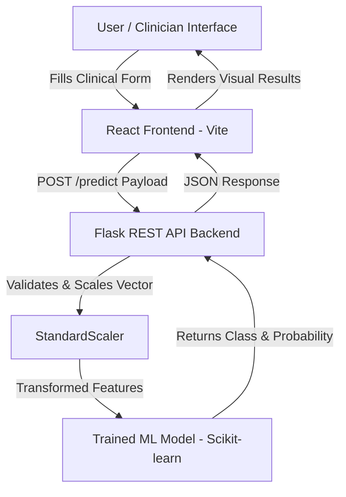

# Parkinson's Disease Prediction using Machine Learning

An end-to-end full-stack Machine Learning application for predicting Parkinson's Disease risk using clinical patient demographics, lifestyle indicators, cardiovascular metrics, and neurological assessments.

---

## 1. Project Title

**Parkinson's Disease Prediction using Machine Learning**

A full-stack predictive system featuring a modern React frontend UI, Python Flask RESTful backend service, and Scikit-learn classification models (Logistic Regression, Decision Tree, K-Nearest Neighbors).

---

## 2. Project Overview

This project provides a full-stack ML solution for Parkinson's disease classification:

* **Machine Learning Engine**: Trains, evaluates, and compares multiple supervised learning algorithms (**Logistic Regression**, **Decision Tree**, and **K-Nearest Neighbors**) on standardized clinical datasets.
* **Backend API**: A Flask application exposing REST endpoints (`/health` and `/predict`) to accept real-time clinical parameters and return predictions alongside probability scores.
* **Interactive Frontend**: A multi-step React web interface equipped with state validation, sample patient presets, dynamic progress indicators, and visual risk summary dashboards.

---

## 3. Why This Project?

Parkinson's disease is a neurodegenerative disorder affecting motor and cognitive functions. Early pattern identification through clinical markers (such as UPDRS motor scores, MoCA cognitive scores, and autonomic indicators) offers valuable decision-support practice for data science and health informatics research.

> **IMPORTANT DISCLAIMER**  
> *This project is an educational machine-learning prediction system and should not be treated as a medical diagnosis.*

---

## 4. When Is This Project Used?

### Appropriate Use Cases:
* Educational demonstrations of full-stack machine learning integration.
* Exploratory Data Analysis (EDA) on clinical health datasets.
* Comparative benchmark evaluation of parametric vs. non-parametric classifiers.
* Reference architecture for serving Scikit-learn models via Flask & React.

### Unintended Use Cases:
* Primary medical diagnostic tool for real patients.
* Replacement for medical consultation, clinical imaging (DAT scan), or specialist diagnosis.

---

## 5. Project Architecture



---

## 6. Folder Structure

```text
Parkinsons-ML-Project/
│
├── FRONTEND/                  # React + Vite Interactive Web UI
│   ├── src/                   # Source components, pages, context, and styles
│   │   ├── components/        # UI components (Forms, Visualizations, Cards)
│   │   ├── data/              # Form schemas and sample patient datasets
│   │   ├── pages/             # Home, About, and Prediction pages
│   │   ├── services/          # Axios/Fetch API client functions
│   │   └── styles/            # CSS stylesheets
│   ├── public/                # Static public assets
│   ├── package.json           # Frontend dependencies & scripts
│   └── vite.config.js         # Vite bundler configuration
│
├── BACKEND/                   # Flask REST API Server
│   ├── app.py                 # Core API endpoints (/health, /predict)
│   ├── test_prediction.py     # Local CLI verification script
│   ├── requirements.txt       # Backend dependencies
│   └── model/                 # Deployed model artifacts (.pkl files)
│
├── ML/                        # Machine Learning Pipeline
│   ├── DATASET/               # Raw and cleaned CSV datasets
│   │   └── parkinsons_dataset.csv
│   │
│   ├── EDA/                   # Exploratory Data Analysis notebooks
│   │   └── EDA.ipynb
│   │
│   ├── MODELS/                # Jupyter notebooks for model development
│   │   ├── logistic_regression.ipynb
│   │   ├── decision_tree.ipynb
│   │   └── knn.ipynb
│   │
│   ├── PYTHON/                # Modular Python training & helper scripts
│   │   ├── preprocessing.py              # Reusable data loading & cleaning module
│   │   ├── train_logistic_regression.py  # Logistic Regression trainer
│   │   ├── train_decision_tree.py        # Decision Tree trainer
│   │   ├── train_knn.py                  # KNN hyperparameter & trainer script
│   │   └── train_all_and_compare.py      # Master benchmark & comparison pipeline
│   │
│   └── RESULTS/               # Quantitative benchmark output
│       ├── model_accuracy.csv # Summary accuracy scores
│       ├── model_comparison.csv # Full metric evaluation matrix
│       └── charts/            # Generated performance plots (model_accuracy.png)
│
├── EXTRA/                     # Utility scripts and archived notebooks
│   ├── generate_notebooks.py
│   └── original_notebooks/
│
├── README.md                  # Comprehensive project documentation
├── requirements.txt           # Global Python environment requirements
└── .gitignore                 # Version control exclusion rules
```

---

## 7. Dataset Specification

* **Dataset Name**: `parkinsons_dataset.csv`
* **Total Records**: 2,105 patients
* **Total Features**: 32 clinical features (+1 identifier column, +1 target column)
* **Target Variable**: `Diagnosis` (0 = Negative / No Parkinson's, 1 = Positive / Parkinson's)

### Feature Description Table:

| Feature Name | Description | Data Type | Used for Prediction? |
| :--- | :--- | :--- | :---: |
| `PatientID` | Unique patient record identifier | Integer | **No (Excluded)** |
| `Age` | Patient age in completed years | Integer | **Yes** |
| `Gender` | Biological sex (0 = Female, 1 = Male) | Categorical | **Yes** |
| `Ethnicity` | Ethnic background category (0-3) | Categorical | **Yes** |
| `EducationLevel` | Completed education level (0-3) | Categorical | **Yes** |
| `BMI` | Body Mass Index ($kg/m^2$) | Continuous | **Yes** |
| `Smoking` | Tobacco user status (0 = No, 1 = Yes) | Binary | **Yes** |
| `AlcoholConsumption` | Weekly alcohol consumption units | Continuous | **Yes** |
| `PhysicalActivity` | Weekly exercise hours | Continuous | **Yes** |
| `Diet` | Diet quality score (0 - 10) | Continuous | **Yes** |
| `SleepQuality` | Sleep quality score (0 - 10) | Continuous | **Yes** |
| `FamilyHistoryParkinsons` | First-degree relative history | Binary | **Yes** |
| `BrainInjury` | Traumatic head injury history | Binary | **Yes** |
| `Hypertension` | Diagnosed high blood pressure | Binary | **Yes** |
| `Diabetes` | Diagnosed diabetes condition | Binary | **Yes** |
| `Depression` | History of clinical depression | Binary | **Yes** |
| `Stroke` | Prior stroke / TIA history | Binary | **Yes** |
| `SystolicBP` | Systolic blood pressure ($mmHg$) | Continuous | **Yes** |
| `DiastolicBP` | Diastolic blood pressure ($mmHg$) | Continuous | **Yes** |
| `CholesterolTotal` | Total cholesterol ($mg/dL$) | Continuous | **Yes** |
| `CholesterolLDL` | LDL cholesterol ($mg/dL$) | Continuous | **Yes** |
| `CholesterolHDL` | HDL cholesterol ($mg/dL$) | Continuous | **Yes** |
| `CholesterolTriglycerides`| Serum triglycerides ($mg/dL$) | Continuous | **Yes** |
| `UPDRS` | Unified Parkinson's Rating Scale score | Continuous | **Yes** |
| `MoCA` | Montreal Cognitive Assessment score | Continuous | **Yes** |
| `FunctionalAssessment` | Daily living independence rating | Continuous | **Yes** |
| `Tremor` | Resting tremor present | Binary | **Yes** |
| `Rigidity` | Muscle rigidity present | Binary | **Yes** |
| `Bradykinesia` | Slowness of movement present | Binary | **Yes** |
| `Posture` | Postural instability present | Binary | **Yes** |
| `SpeechProblems` | Speech impairment present | Binary | **Yes** |
| `SleepDisorders` | REM sleep disorder present | Binary | **Yes** |
| `Constipation` | Gastrointestinal motility impairment | Binary | **Yes** |
| `Diagnosis` | **Target variable** (0 = No, 1 = Yes) | Binary | **Target** |

---

## 8. Exploratory Data Analysis (EDA)

The EDA notebook (`ML/EDA/EDA.ipynb`) performs structured data inspection:

1. **Missing Value Analysis**: Confirms zero missing values across clinical variables; drops empty trailing CSV artifact columns (`Unnamed: 34`, `Unnamed: 35`).
2. **Duplicate Analysis**: Detects and eliminates redundant duplicate patient rows.
3. **Distribution Analysis**: Visualizes age ranges, gender proportions, and BMI distributions.
4. **Correlation Analysis**: Generates correlation matrices demonstrating significant feature correlations between UPDRS scores, MoCA cognitive ratings, motor symptoms, and Diagnosis.
5. **Identifier Exclusion**: Ensures `PatientID` is strictly retained for metadata identification and excluded from model feature sets $X$.

---

## 9. Machine Learning Methods Used

### 1. Logistic Regression

Parametric binary classification algorithm fitting a linear decision boundary mapped through a sigmoid function.

* **Sigmoid Formula**:
  $$P(y=1 \mid z) = \frac{1}{1 + e^{-z}} \quad \text{where} \quad z = \beta_0 + \beta_1 x_1 + \dots + \beta_n x_n$$
* **Key Hyperparameters**: `max_iter=1000`, `random_state=42`, fitted on `StandardScaler` transformed features.
* **Advantages**: Highly interpretable coefficients, probabilistic outputs, stable convergence.

---

### 2. Decision Tree Classifier

Non-parametric tree-structured model splitting data recursively based on feature thresholds to maximize node purity.

* **Splitting Criteria (Gini Impurity)**:
  $$\text{Gini}(t) = 1 - \sum_{i=1}^{C} p_i^2$$
* **Key Hyperparameters**: `random_state=42`.
* **Advantages**: Captures non-linear feature interactions without requiring monotone scaling.

---

### 3. K-Nearest Neighbors (KNN)

Distance-based instance learning algorithm classifying new samples by majority voting among the $k$ closest training vectors.

* **Euclidean Distance Formula**:
  $$d(p, q) = \sqrt{\sum_{i=1}^{n} (p_i - q_i)^2}$$
* **Hyperparameter Tuning**: Evaluated $k \in \{3, 5, 7, 9\}$ on `StandardScaler` normalized data; $k=7$ achieved optimal F1 balance.
* **Advantages**: Adaptable to non-linear decision spaces.

---

## 10. Model Comparison & Evaluation Results

All models were evaluated on the **exact same 20% test set** (421 unseen patient records) under stratified split sampling:

| Model Algorithm | Accuracy | Precision | Recall | F1 Score | ROC-AUC |
| :--- | :---: | :---: | :---: | :---: | :---: |
| **Decision Tree** | **86.94%** | **91.20%** | 87.36% | **89.24%** | 0.8680 |
| **Logistic Regression** | 80.52% | 83.03% | **86.21%** | 84.59% | **0.8980** |
| **K-Nearest Neighbors ($k=7$)** | 75.53% | 77.62% | 85.06% | 81.17% | 0.8019 |

> **Note on Evaluation Metrics**: Accuracy alone is insufficient for medical datasets due to class imbalance (~62% positive cases). F1 Score and Recall are essential to minimize false negatives (missing true Parkinson's cases).

---

## 11. Complete Machine Learning Workflow

```text
Raw Dataset (parkinsons_dataset.csv)
       ↓
Data Cleaning (Drop Unnamed Columns & Duplicates)
       ↓
EDA & Feature Analysis
       ↓
Feature/Target Separation (Exclude PatientID)
       ↓
Stratified Train/Test Split (80% Train, 20% Test)
       ↓
StandardScaler Feature Scaling
       ↓
Model Training (Logistic Regression, Decision Tree, KNN)
       ↓
Prediction & Probability Score Calculation
       ↓
Evaluation (Accuracy, Precision, Recall, F1, ROC-AUC)
       ↓
Benchmark Comparison & Artifact Deployment
```

---

## 12. Frontend Overview

* **Framework**: React 18 built with Vite for fast HMR.
* **Form Interface**: Multi-step wizard dividing 32 features into 6 intuitive clinical sections.
* **Patient ID Update**: `PatientID` has been **completely removed** from prediction input forms, state validation, and sample patient payloads.
* **Validation**: Live numerical range checking matching backend specifications.
* **Result View**: Displays risk level badge, probability progress ring, and patient summary breakdown.

---

## 13. Backend Overview

* **Framework**: Python Flask API with CORS support.
* **Endpoints**:
  * `GET /health`: Health check verifying model artifact availability.
  * `POST /predict`: Validates 32 input feature values, applies scaler transformation, and executes model prediction.

---

## 14. Installation & Setup

### Prerequisites:
* Python 3.9+
* Node.js 18+ and npm

### 1. Clone Project Repository
```bash
git clone <repository-url>
cd Parkinsons-ML-Project
```

### 2. Install ML & Backend Dependencies
```bash
pip install -r requirements.txt
```

### 3. Install Frontend Dependencies
```bash
cd FRONTEND
npm install
```

---

## 15. How to Run

### Step 1: Start Flask Backend Server
```bash
cd BACKEND
python app.py
```
*Server starts on `http://127.0.0.1:5000`.*

### Step 2: Start React Frontend Application
```bash
cd FRONTEND
npm run dev
```
*App opens on `http://localhost:3000` (or `http://localhost:5173`).*

### Step 3: Run Prediction
1. Open frontend in browser.
2. Load sample data preset or manually fill patient clinical markers.
3. Click **Generate ML Prediction**.
4. View prediction outcome and risk probability score.

---

## 16. Technologies Used

| Category | Technology |
| :--- | :--- |
| **Frontend Framework** | React.js (Vite) |
| **Icons & Styling** | Lucide React, Custom CSS3 |
| **Backend Framework** | Python Flask, Flask-CORS |
| **Data Processing** | Pandas, NumPy |
| **Machine Learning** | Scikit-learn (`LogisticRegression`, `DecisionTreeClassifier`, `KNeighborsClassifier`) |
| **Model Serialization** | Joblib |
| **Visualization** | Matplotlib, Seaborn |
| **Notebook Environment**| Jupyter Notebook |

---

## 17. Evaluation Metrics Explained

* **Accuracy**: Proportion of total correct predictions: $\frac{TP + TN}{TP + TN + FP + FN}$.
* **Precision**: Proportion of positive predictions that were accurate: $\frac{TP}{TP + FP}$.
* **Recall (Sensitivity)**: Ability of model to find all positive cases: $\frac{TP}{TP + FN}$.
* **F1 Score**: Harmonic mean of Precision and Recall: $2 \times \frac{\text{Precision} \times \text{Recall}}{\text{Precision} + \text{Recall}}$.
* **Confusion Matrix**: 2x2 grid charting True Positives, False Positives, True Negatives, and False Negatives.

---

## 18. Project Limitations

1. **Dataset Size**: Dataset consists of 2,105 synthetic/clinical records; further real-world validation is needed.
2. **Class Imbalance**: Positive cases comprise ~62% of dataset rows.
3. **No Medical Validation**: Output is an educational statistical inference and not clinically certified.

---

## 19. Future Improvements

* Implementation of Ensemble methods (Random Forest, XGBoost, LightGBM).
* Hyperparameter optimization via `GridSearchCV` or `RandomizedSearchCV`.
* Model explainability integration using SHAP (SHapley Additive exPlanations) values.
* Docker containerization for production deployment.

---

## 20. Author & Academic Attribution

Developed as an educational **Full-Stack Machine Learning Project** for medical data analysis and predictive modeling demonstrations.
